# 基于WEB的银行知识库系统设计与实现 解析稿

## 来源映射
- 源文件（doc）: 基于WEB的银行知识库系统设计与实现.doc
- 转换文件（docx）: 基于WEB的银行知识库系统设计与实现.docx
- 解析时间: 2026-04-11 04:07:39
- 转换方式: Word COM 批量转换（doc -> docx）
- 输出文件: 基于WEB的银行知识库系统设计与实现.md

## 文档概览
- 正文段落数: 368
- 识别标题数: 111
- 表格数: 17
- 图片数: 54
- 估算字符数（去空白）: 52530

## 章节结构（自动识别）
1. 1 绪论 1
2. 1.1 课题来源和研究背景 1
3. 1.2 系统开发的目的与意义 1
4. 1.3 知识库系统的研究现状 1
5. 1.3.1 国外研究现状 1
6. 1.3.2 国内研究现状 2
7. 1.4 本文研究的内容 2
8. 2 系统相关技术概述 3
9. 2.1 系统开发语言 3
10. 2.1.1 Java语言 3
11. 2.1.2 jQuery脚本语言 3
12. 2.1.3 AJAX脚本语言 3
13. 2.2 系统开发工具 4
14. 2.3 SSH框架技术 4
15. 2.3.1 Struts框架 4
16. 2.3.2 Spring框架 5
17. 2.3.3 Hibernate框架 5
18. 2.4 DB2数据库技术 6
19. 3 系统分析 6
20. 3.1 系统可行性分析 6
21. 3.1.1 技术可行性 6
22. 3.1.2 操作可行性 6
23. 3.2 系统需求分析 6
24. 3.2.1 前台系统需求分析 6
25. 3.2.2 后台管理系统需求分析 7
26. 3.3 系统业务流程图 7
27. 4 系统总体设计 8
28. 4.1 系统体系结构设计 8
29. 4.2 系统功能模块设计 9
30. 4.2.1 前台系统功能模块设计 9
31. 4.2.2 后台系统功能模块设计 14
32. 4.3 系统数据库设计 20
33. 5 系统详细设计与实现 29
34. 5.1 知识库前台系统 29
35. 5.1.1 前台系统主界面模块 29
36. 5.1.2 交流平台模块 29
37. 5.1.3 考试平台模块 30
38. 5.1.4 知识展示模块 31
39. 5.2 知识库后台系统 32
40. 5.2.1 后台系统主界面模块 32
41. 5.2.2 维度管理模块 34
42. 5.2.3 交流平台管理模块 35
43. 5.2.4 报表管理模块 36
44. 5.2.5 考试平台管理模块 37
45. 6 系统测试 39
46. 7 总结 43
47. 设计总说明
48. introduction
49. 绪论
50. 课题来源和研究背景
51. 系统开发的目的与意义
52. 知识库系统的研究现状
53. 国外研究现状
54. 国内研究现状
55. 本文研究的内容
56. 系统相关技术概述
57. 系统开发语言
58. Java语言
59. jQuery脚本语言
60. AJAX脚本语言
61. 系统开发工具
62. SSH框架技术
63. Struts框架
64. Spring框架
65. Hibernate框架
66. DB2数据库技术
67. 系统分析
68. 系统可行性分析
69. 技术可行性
70. 操作可行性
71. 系统需求分析
72. 前台系统需求分析
73. 后台管理系统需求分析
74. 系统业务流程图
75. 系统总体设计
76. 系统体系结构设计
77. 系统功能模块设计
78. 前台系统功能模块设计
79. 系统登录
80. 用户修改

## 关键信息提炼
### 主题词频
- 系统: 314 次
- 设计: 147 次
- 知识库: 121 次
- 数据库: 66 次
- 测试: 54 次
- 权限: 48 次
- 实现: 47 次
- 需求: 36 次
- 日志: 18 次
- 银行知识库: 11 次
- 性能: 8 次
- 安全: 8 次
- 检索: 6 次
- 部署: 2 次

### 缺失项提示（用于后续补写）
- 系统实现
- 结论

### 低置信度片段
- 未发现明显乱码或异常短段落。

## 图片提取与解读
- 已提取图片数: 54
- 图片目录: images/基于WEB的银行知识库系统设计与实现
- 自动识别图题数: 48

### 图 1: 图3-1 知识库系统业务流程图
- 原始文件: image18.emf
- 描述: 未提供图片描述，建议补充图题与图注。

### 图 2: 图4-1 系统体系结构图
- 原始文件: image23.png
- 描述: 未提供图片描述，建议补充图题与图注。
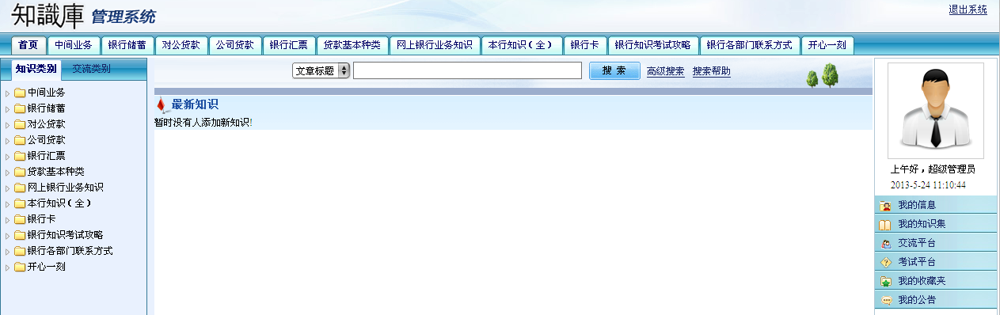

### 图 3: 图4-2 系统前台功能框架
- 原始文件: image1.png
- 描述: 未提供图片描述，建议补充图题与图注。

### 图 4: 图4-3 知识库登录流程图
- 原始文件: image2.png
- 描述: 未提供图片描述，建议补充图题与图注。
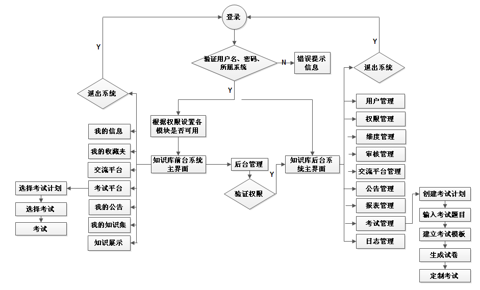

### 图 5: 图4-4 用户修改流程图
- 原始文件: image3.png
- 描述: 未提供图片描述，建议补充图题与图注。
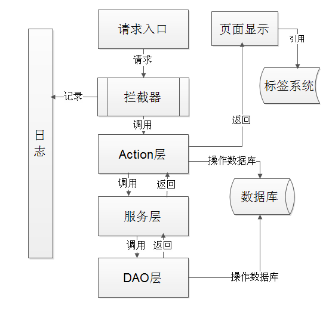

### 图 6: 图4-5 知识展示流程图
- 原始文件: image4.png
- 描述: 未提供图片描述，建议补充图题与图注。
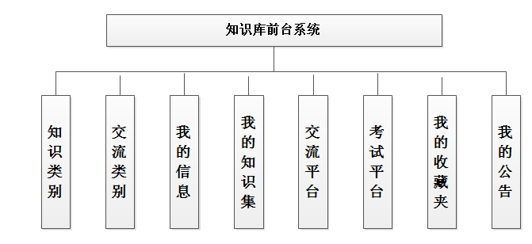

### 图 7: 图4-6 用户考试流程图
- 原始文件: image5.emf
- 描述: 未提供图片描述，建议补充图题与图注。

### 图 8: 图4-7 考试评卷流程图
- 原始文件: image10.emf
- 描述: 未提供图片描述，建议补充图题与图注。

### 图 9: 图4-8 成绩查询流程图
- 原始文件: image6.emf
- 描述: 未提供图片描述，建议补充图题与图注。

### 图 10: 图4-9 系统后台功能框架
- 原始文件: image7.emf
- 描述: 未提供图片描述，建议补充图题与图注。

### 图 11: 图4-10 角色绑定流程图
- 原始文件: image8.emf
- 描述: 未提供图片描述，建议补充图题与图注。

### 图 12: 图4-11 审核权限管理流程图
- 原始文件: image9.emf
- 描述: 未提供图片描述，建议补充图题与图注。

### 图 13: 图4-12 前台展示权限管理流程图
- 原始文件: image43.png
- 描述: 未提供图片描述，建议补充图题与图注。
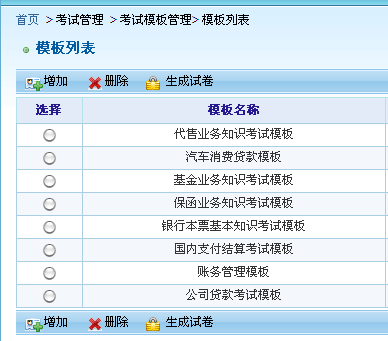

### 图 14: 图4-13 知识点维度增加流程图
- 原始文件: image11.png
- 描述: 未提供图片描述，建议补充图题与图注。
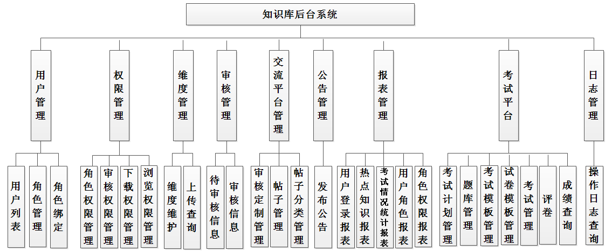

### 图 15: 图4-14 知识点维度修改流程图
- 原始文件: image12.emf
- 描述: 未提供图片描述，建议补充图题与图注。

### 图 16: 图4-15 交流平台管理流程图
- 原始文件: image13.emf
- 描述: 未提供图片描述，建议补充图题与图注。

### 图 17: 图4-16 考试计划管理流程图
- 原始文件: image14.emf
- 描述: 未提供图片描述，建议补充图题与图注。

### 图 18: 图4-17 题库管理流程图
- 原始文件: image15.emf
- 描述: 未提供图片描述，建议补充图题与图注。

### 图 19: 图4-18 日志查询流程图
- 原始文件: image16.emf
- 描述: 未提供图片描述，建议补充图题与图注。

### 图 20: 图4-19 用户浏览搜索表关系图
- 原始文件: image17.emf
- 描述: 未提供图片描述，建议补充图题与图注。

### 图 21: 图4-20 交流平台表关系图
- 原始文件: image24.png
- 描述: 未提供图片描述，建议补充图题与图注。
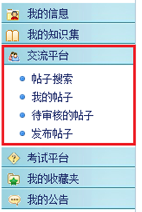

### 图 22: 图4-21 后台管理系统表关系图
- 原始文件: image25.png
- 描述: 未提供图片描述，建议补充图题与图注。

### 图 23: 图5-1 前台主界面图
- 原始文件: image26.png
- 描述: 未提供图片描述，建议补充图题与图注。
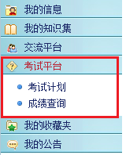

### 图 24: 图5-2 交流平台操作界面图
- 原始文件: image27.png
- 描述: 未提供图片描述，建议补充图题与图注。

### 图 25: 图5-3 帖子操作界面图
- 原始文件: image28.png
- 描述: 未提供图片描述，建议补充图题与图注。

### 图 26: 图5-4 考试平台操作界面图
- 原始文件: image29.png
- 描述: 未提供图片描述，建议补充图题与图注。

### 图 27: 图5-5 考试计划展示图
- 原始文件: image30.png
- 描述: 未提供图片描述，建议补充图题与图注。

### 图 28: 图5-6 知识展示操作界面图
- 原始文件: image31.png
- 描述: 未提供图片描述，建议补充图题与图注。

### 图 29: 图5-7 知识展示图
- 原始文件: image32.png
- 描述: 未提供图片描述，建议补充图题与图注。

### 图 30: 图5-8 文件展示效果图
- 原始文件: image33.png
- 描述: 未提供图片描述，建议补充图题与图注。

### 图 31: 图5-9 后台系统主界面图
- 原始文件: image34.png
- 描述: 未提供图片描述，建议补充图题与图注。

### 图 32: 图5-10 维度管理操作界面图
- 原始文件: image35.png
- 描述: 未提供图片描述，建议补充图题与图注。

### 图 33: 图5-11 交流平台操作界面图
- 原始文件: image36.png
- 描述: 未提供图片描述，建议补充图题与图注。
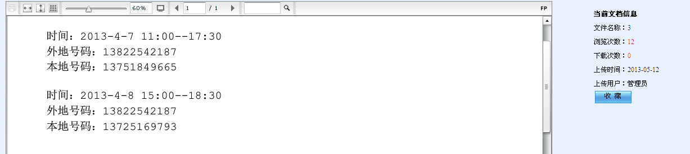

### 图 34: 图5-12 报表管理操作界面图
- 原始文件: image37.png
- 描述: 未提供图片描述，建议补充图题与图注。
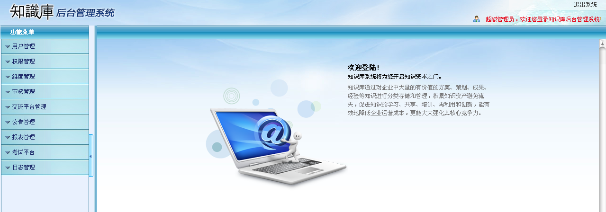

### 图 35: 图5-13 考试计划管理界面图
- 原始文件: image38.png
- 描述: 未提供图片描述，建议补充图题与图注。
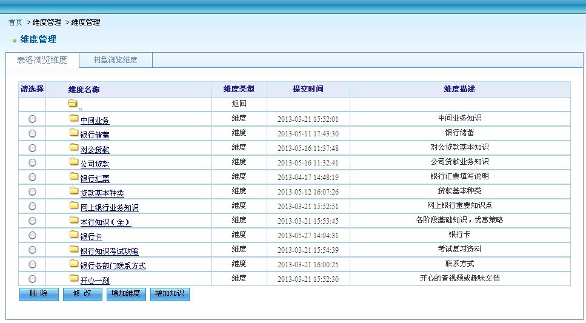

### 图 36: 图5-14 考试计划管理界面图
- 原始文件: image39.png
- 描述: 未提供图片描述，建议补充图题与图注。
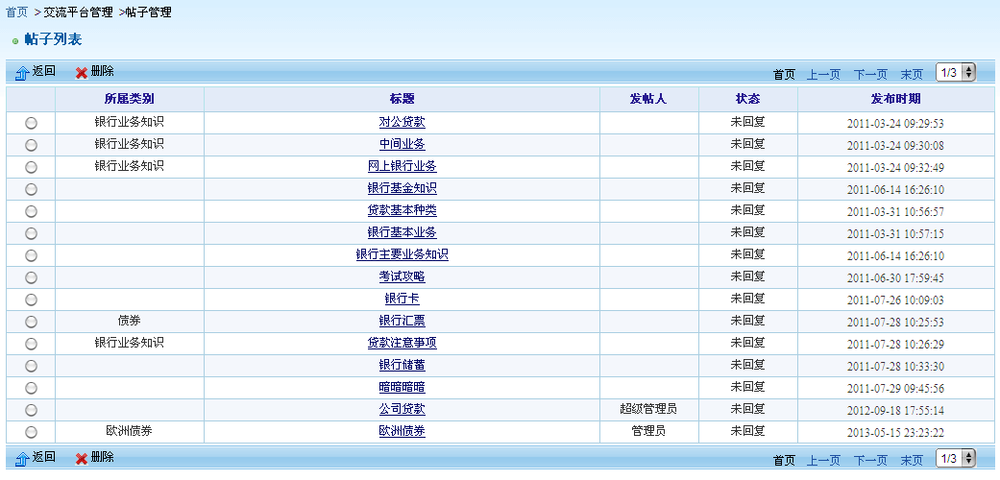

### 图 37: 图5-15 考试模板管理界面图
- 原始文件: image40.png
- 描述: 未提供图片描述，建议补充图题与图注。
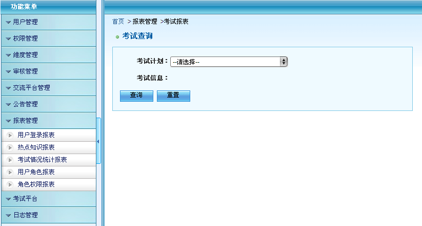

### 图 38: 图5-16 定制考试界面图
- 原始文件: image41.png
- 描述: 未提供图片描述，建议补充图题与图注。
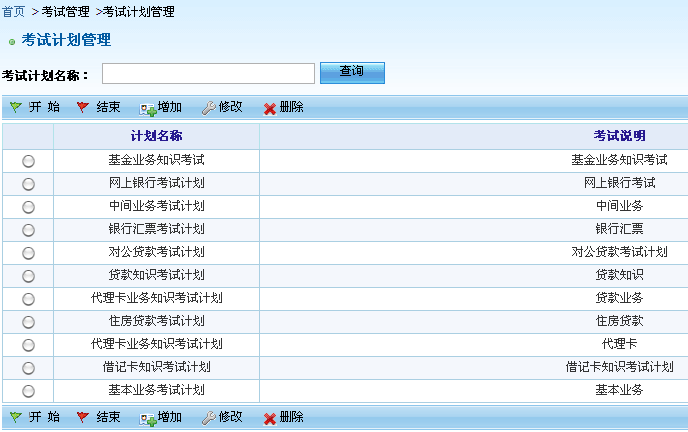

### 图 39: 图6-1 登录测试操作图
- 原始文件: image42.png
- 描述: 未提供图片描述，建议补充图题与图注。
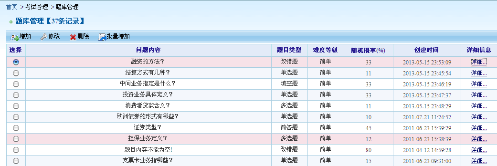

### 图 40: 图6-2 登录测试结果图
- 原始文件: image19.emf
- 描述: 未提供图片描述，建议补充图题与图注。

### 图 41: 图6-3 发表帖子测试操作图
- 原始文件: image44.png
- 描述: 未提供图片描述，建议补充图题与图注。
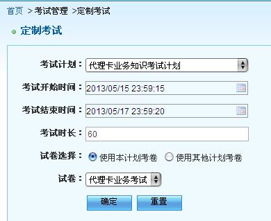

### 图 42: 图6-4 发表帖子测试结果图
- 原始文件: image45.png
- 描述: 未提供图片描述，建议补充图题与图注。
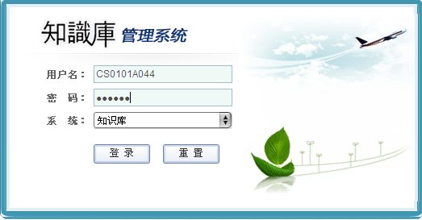

### 图 43: 图6-5 用户自测测试操作图
- 原始文件: image46.png
- 描述: 未提供图片描述，建议补充图题与图注。
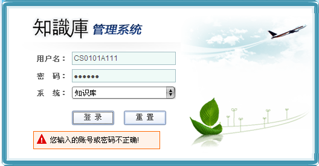

### 图 44: 图6-6 用户自测测试结果图
- 原始文件: image47.png
- 描述: 未提供图片描述，建议补充图题与图注。
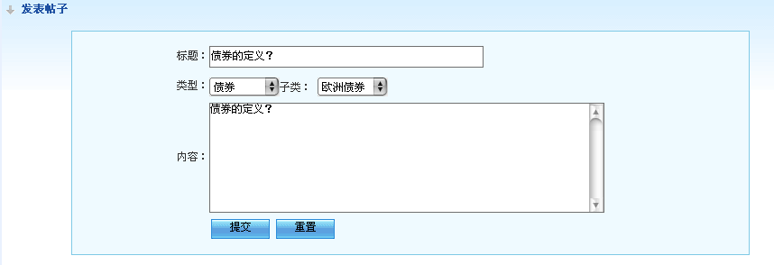

### 图 45: 图6-7 维度增加测试操作图
- 原始文件: image48.png
- 描述: 未提供图片描述，建议补充图题与图注。

### 图 46: 图6-8 维度增加测试结果图
- 原始文件: image49.png
- 描述: 未提供图片描述，建议补充图题与图注。

### 图 47: 图6-9 报表管理测试操作图
- 原始文件: image50.png
- 描述: 未提供图片描述，建议补充图题与图注。

### 图 48: 图6-10 报表管理测试结果图
- 原始文件: image51.png
- 描述: 未提供图片描述，建议补充图题与图注。
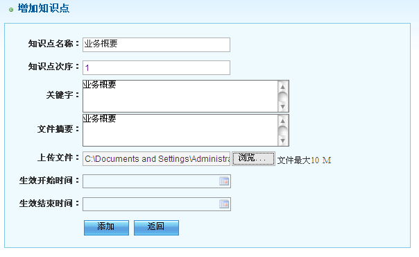

### 图 49: 图片49
- 原始文件: image52.png
- 描述: 未提供图片描述，建议补充图题与图注。

### 图 50: 图片50
- 原始文件: image53.png
- 描述: 未提供图片描述，建议补充图题与图注。
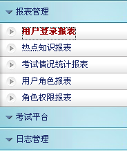

### 图 51: 图片51
- 原始文件: image54.png
- 描述: 未提供图片描述，建议补充图题与图注。
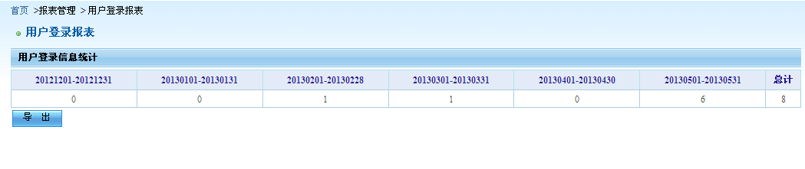

### 图 52: 图片52
- 原始文件: image20.png
- 描述: 未提供图片描述，建议补充图题与图注。
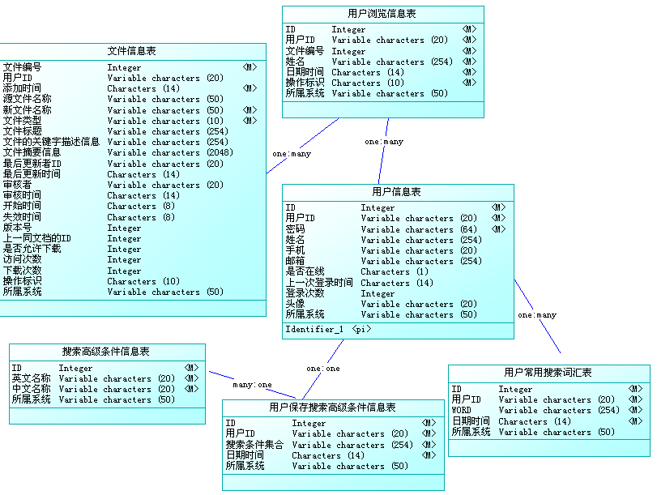

### 图 53: 图片53
- 原始文件: image21.png
- 描述: 未提供图片描述，建议补充图题与图注。
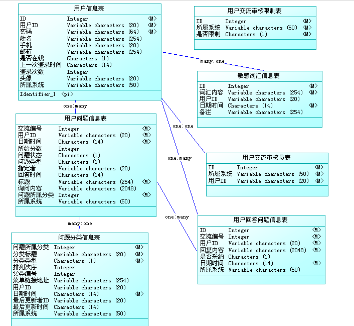

### 图 54: 图片54
- 原始文件: image22.png
- 描述: 未提供图片描述，建议补充图题与图注。
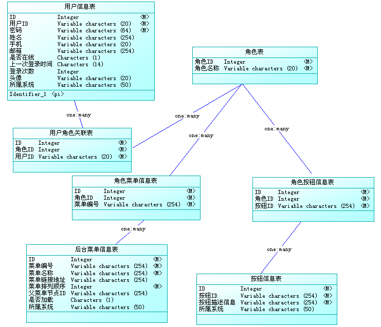

## 详细内容（按解析顺序）

### 表格 1
| 基于WEB的银行知识库系统设计与实现 |
| --- |

### 表格 2
| Design and Realization of Bank Knowledge Base System Based on Web |
| --- |

### 表格 3
| 学生姓名 | 郑 | 学号 | 202011621133 |
| --- | --- | --- | --- |
| 所在学院 | 数学与计算机学院 | 班级 | 计科1133班 |
| 所在专业 | 计算机科学与技术 |  |  |
| 申请学位 | 工学学士 |  |  |
| 指导教师 | 孙兵 | 职称 | 副教授 |
| 副指导教师 |  | 职称 |  |
| 答辩时间 | 2026年 6 月 1 日 |  |  |

目 录
设计总说明 I
introduction III
### 1 绪论 1
#### 1.1 课题来源和研究背景 1
#### 1.2 系统开发的目的与意义 1
#### 1.3 知识库系统的研究现状 1
##### 1.3.1 国外研究现状 1
##### 1.3.2 国内研究现状 2
#### 1.4 本文研究的内容 2
### 2 系统相关技术概述 3
#### 2.1 系统开发语言 3
##### 2.1.1 Java语言 3
##### 2.1.2 jQuery脚本语言 3
##### 2.1.3 AJAX脚本语言 3
#### 2.2 系统开发工具 4
#### 2.3 SSH框架技术 4
##### 2.3.1 Struts框架 4
##### 2.3.2 Spring框架 5
##### 2.3.3 Hibernate框架 5
#### 2.4 DB2数据库技术 6
### 3 系统分析 6
#### 3.1 系统可行性分析 6
##### 3.1.1 技术可行性 6
##### 3.1.2 操作可行性 6
#### 3.2 系统需求分析 6
##### 3.2.1 前台系统需求分析 6
##### 3.2.2 后台管理系统需求分析 7
#### 3.3 系统业务流程图 7
### 4 系统总体设计 8
#### 4.1 系统体系结构设计 8
#### 4.2 系统功能模块设计 9
##### 4.2.1 前台系统功能模块设计 9
##### 4.2.2 后台系统功能模块设计 14
#### 4.3 系统数据库设计 20
### 5 系统详细设计与实现 29
#### 5.1 知识库前台系统 29
##### 5.1.1 前台系统主界面模块 29
##### 5.1.2 交流平台模块 29
##### 5.1.3 考试平台模块 30
##### 5.1.4 知识展示模块 31
#### 5.2 知识库后台系统 32
##### 5.2.1 后台系统主界面模块 32
##### 5.2.2 维度管理模块 34
##### 5.2.3 交流平台管理模块 35
##### 5.2.4 报表管理模块 36
##### 5.2.5 考试平台管理模块 37
### 6 系统测试 39
### 7 总结 43
鸣 谢 44
参考文献 45
## 设计总说明
人类跟随社会发展的步伐进入信息化的时代，各种创新型应用与互联网概念随之不断出现，人类顺应科技时代的洪流，利用创新力量造就了无限可能，社会的进步，从未停止。在如今这个信息化高速发展的时代，意味着大学生之间的竞争将会变得十分地激烈，同时也意味着大学生的未来会遇上无限的机遇与挑战，所以，利用在学校的时间来提高大学生的自身素质以及实操能力将变得十分重要。大学生站在社会新技术、新思想的前沿，具备了发现和创造新事物的能力，在大学期间或多或少都会创造出自己的创意作品。学习过《Web开发技术》课程的大学生，他们手中的创意作品闲置在手中，没有发挥出其真正的价值，这就导致了一定程度上资源浪费。那么，学习《Web开发技术》课程的大学生，他们有技术、有能力、有想法，完全可以将自身具备的专业技能、知识以及想法通过互联网获益。
本设计为一个基于Java EE的作品展示交易平台，使用Java语言与Spring MVC、Spring、MyBatis框架进行开发，利用jQuery框架与JSP技术实现本设计的界面。
本设计的原则主要是参考市面上类似的威客网站进行研究开发，对作品类型细分为创意Web设计作品，并且专注于实现简约界面，让系统易于理解，特别是注重于系统的实用性。目前，市面上许多的网页设计专注于华丽的装饰，或者页面信息十分冗杂、繁乱，而忽略了系统本身的实用性。因此，本设计具有特点就是设计整洁，专注于实用性。在系统开发过程中，本设计根据实际情况，满足系统需求，因此本设计所设计的界面主要有系统的前台界面与后台界面，前台系统的使用者主要是游客、学生用户与企业用户，后台管理系统的使用者是管理员。前台系统对于使用者的不同，有相同的功能：公告展示与留言反馈；但是也会根据用户的权限展现不同的功能；游客由于未进行系统前台的登录操作，只能进行创意Web设计作品的浏览、创意Web设计作品的搜索以及查看创意Web设计作品详情。创意Web设计作品详情页主要展示的是：关于该创意Web设计作品的一些相关信息，以及已经购买该作品的企业用户的评价内容；学生用户可以进行创意Web设计作品上传，接受定制任务，修改个人信息等；企业用户可以进行创意Web设计作品的购买，创意Web设计作品的收藏、创意Web设计作品评价、定制需求的发布等。后台管理系统的功能有：定制需求管理，主要为用户提供创意Web设计作品的定制需求的搜索、审核功能；创意Web设计作品管理，主要为用户提供创意Web作品搜索、审核及删除功能；创意Web设计作品类目管理，主要为用户提供创意Web作品类目的增加、修改及删除功能；用户管理，主要为用户提供对学生用户与企业用户的搜索、注销功能；公告管理，主要为用户提供公告的发布、修改、删除及搜索功能等。
本设计基于集成开发环境工具软件IntelliJ IDEA 进行开发，在技术应用方面，创意Web设计作品展示交易平台主要是运用MVC模式，利用Spring MVC 作为系统的前端控制器，利用Spring 来进行各层的组件的管理，利用MyBatis 进行持久层开发；并通过前端框架jQuery进行开发，利用MySQL数据库进行本设计的数据存储。前台页面设计使用JSP技术实现，JSP是一种动态页面开发技术，利用其标签库技术可以复用常用的功能代码；同时，前台页面还利用了ajax进行数据的交互。由于，本设计涉及到创意Web设计作品交易功能，所以使用了支付宝的沙箱环境，支付宝的沙箱环境对开发者非常友好，适用于尚未正式上线的产品，使用沙箱环境的效果与正式上线的结果相似。
创意Web设计作品展示交易平台基本符合大学生与企业用户的需求，学生提前接触市场，有利于其可以更好、更快地适应社会。也由于自身对实现这样的一个平台十分感兴趣，借此机会，进行创意Web设计作品展示交易平台的开发。同时也借此机会来提升自身产品设计能力、开发能力，并学习对一个完整产品的维护和改进，全方面地提升专业技术能力。
关键词：知识管理；SSM框架；SSH架构
## introduction
Following the pace of social development, mankind has entered the era of informatization, and various innovative applications and Internet concepts have continued to emerge. Mankind has adapted to the torrent of the era of science and technology, using innovative power to create infinite possibilities, and social progress has never stopped. In today's era of rapid development of information technology, it means that the competition between college students will become very fierce, and it also means that college students' future will encounter infinite opportunities and challenges. Therefore, use the time in school to improve the quality and practical ability of college students will become very important. College students stand at the forefront of new technologies and new ideas in society, possess the ability to discover and create new things, and more or less create their own creative works during their college years. Undergraduates who have studied the course of "Web Development Technology", their creative works are idle in their hands, and their true value is not displayed, which leads to a certain degree of waste of resources. So, college students studying the "Web Development Technology" course, they have the technology, ability, and ideas, they can fully benefit from their own professional skills, knowledge and ideas through the Internet.
This design is a Java EE based work display trading platform, using Java language and Spring MVC, Spring, MyBatis framework for development, using jQuery framework and JSP technology to realize the interface of this design.
The principle of this design is mainly to refer to similar freelance websites on the market for research and development, subdivide the types of works into creative web design works, and focus on achieving a simple interface, making the system easy to understand, especially focusing on the practicality of the system. At present, many web page designs on the market focus on gorgeous decoration, or the page information is very complicated and messy, while ignoring the practicality of the system itself. Therefore, this design is characterized by clean design and focus on practicality. In the system development process, this design meets the needs of the system according to the actual situation. Therefore, the interface designed by this design mainly includes the front-end interface and the back-end interface of the system. The users of the front-end system are mainly tourists, student users and enterprise users, and the back-end management The user of the system is the administrator. The front desk system has the same functions for different users: announcement display and message feedback; but different functions will be displayed according to the user's authority; because tourists have not logged in to the front desk of the system, they can only browse creative web design works , Search for creative web design works and view details of creative web design works. The details page of the creative web design work mainly displays: some relevant information about the creative web design work, as well as the evaluation content of the enterprise users who have purchased the work; student users can upload creative web design works, accept customized tasks, and modify individuals Information, etc.; enterprise users can purchase creative Web design works, collect creative Web design works, evaluate creative Web design works, publish customized requirements, etc. The functions of the back-end management system include: customized demand management, which mainly provides users with search and review functions for customized needs of creative Web design works; creative Web design work management, which mainly provides users with creative Web works search, review and delete functions; creative Web Design work category management, mainly to provide users with the functions of adding, modifying and deleting creative Web work categories; user management, mainly providing users with search and logout functions for student users and corporate users; announcement management, mainly providing users with announcements Release, modify, delete and search functions of.
This design is developed based on the integrated development environment tool software IntelliJ IDEA. In terms of technical application, the creative web design work display trading platform mainly uses the MVC model, using Spring MVC as the front controller of the system, and using Spring to carry out the components of each layer. For management, use MyBatis for persistence layer development; use the front-end framework jQuery for development, and use MySQL database for data storage of this design. The front-end page design is implemented using JSP technology. JSP is a dynamic page development technology that uses its tag library technology to reuse commonly used function codes; at the same time, the front-end page also uses ajax for data interaction. Since this design involves the transaction function of creative web design works, the sandbox environment of Alipay is used. The sandbox environment of Alipay is very friendly to developers and is suitable for products that have not yet been officially launched. The effect of using the sandbox environment and the official launch the results are similar.
The creative Web design work display and trading platform basically meets the needs of college students and corporate users. Students' early exposure to the market will help them adapt to society better and faster. Because I am very interested in implementing such a platform, I take this opportunity to develop a creative Web design work display trading platform. At the same time, I also take this opportunity to improve my product design and development capabilities, and learn how to maintain and improve a complete product, so as to enhance professional and technical capabilities in all aspects.
Keywords: Knowledge Management; Knowledge Base; SSH Framework
基于WEB的银行知识库系统设计与实现
计算机科学与技术，202011621133，郑
指导教师：孙兵
毕业设计说明书
## 绪论
### 课题来源和研究背景
随着银行客户服务中心在银行系统中重要性的加大,银行客户服务中心知识库的建设就成为客户服务系统开发的中心环节,围绕着更好地为银行客户提供便捷的服务这个基本点, 北京宇信易诚科技有限公司根据广东发展银行的业务需求，结合系统开发的基本原理和方法，开发设计了银行知识库系统。本课题的选取是为了满足银行客户服务中心的需求进行实现。
### 系统开发的目的与意义
随着中国金融行业的快速发展，金融机构之间面临着激烈的竞争，为了解决业务管理部门的知识生产、审核与座席人员的知识使用被割裂的问题，使客户享受更高质量的专业服务，提升银行在激烈的金融市场中的竞争力，并结合金融机构的服务管理模式，建立了一种信息化、现代化和规范化的银行知识管理模式。
建立知识库，大量隐含知识被编码化和数字化，信息和知识便从原来的混乱状态变得有序化，方便了信息和知识的检索，并为有效使用打下了基础。知识和信息的有序化，也自然使人们获取新信息和新知识的速度加快，更有利于彼此的交流和协助。而对于管理上，知识库能帮助企业实现知识的有效保存，避免知识信息的流失。
### 知识库系统的研究现状
#### 国外研究现状
知识库使基于知识的系统具有智能性。并不是所有具有智能的程序都拥有知识库，只有基于知识的系统才拥有知识库。现在许多应用程序都利用知识，其中有的还达到了很高的水平，但是，这些应用程序可能并不是基于知识的系统，它们也不拥有知识库。一般的应用程序与基于知识的系统之间的区别在于：一般的应用程序是把问题求解的知识隐含地编码在程序中，而基于知识的系统则将应用领域的问题求解知识显式地表达，并单独地组成一个相对独立的程序实体。
由于科技知识的快速发展，知识更新程度越来越快，知识库系统发展和普及也随之越来越快，就机构知识库系统而言，在国外欧、美、亚国家的发展现状如下：
欧洲共有33个国家建立了886个机构知识库，美国建立395个机构知识库，在亚洲，共有25个国家建立321个机构知识库，发展最快的是日本和印度。数据分析表明，知识库在欧美国家普及程度最高，而且发展速度最快，发展中国家普及程度较低。
#### 国内研究现状
随着金融市场的不断发展，客户的需求以及对服务质量的要求不断提高，对银行客户服务中心的服务能力提出了更高的要求。做为直接面向终端客户的客户服务部门，知识库成为日常应答客户问题、提升工作效率必备的工具，但当前国内某些金融机构用共享文件服务器管理知识库的模式存在较为突出的问题，造成了工作效率降低，座席相应时间增长，业务管理部门的知识生产、审核与座席人员的知识使用被割裂等问题，因此为了顺应时代发展，取得更大的社会效应和经济效应，金融机构需要一套更结构化，易操作，易利用，全面有组织的知识集群的知识库管理系统来提升自身的服务能力和市场竞争力。
目前，一般的知识库管理系统具有如下几个方面特性：
（1）知识库系统所管理的知识限于事实与规则两种；
（2）知识库系统应能管理大量知识；
（3）知识库系统所采用的语言大多数用逻辑语言，即用谓词逻辑表示；
（4）知识库系统里完成对知识的操作，其中主要包括一致性校验、知识的演绎检索、知识的交流等。
### 本文研究的内容
本研究针对银行客服中心的行业特性和经营特点，开发设计了一个银行知识库系统。其中包括知识库前台系统和知识库后台系统，知识库后台系统主要是包括用户管理、权限管理、维度管理、审核管理、交流平台管理和考试管理等功能，另后台系统还包括报表管理和供数据安全审核的日志管理功能；知识库前台系统为用户日常使用的系统，可以对知识点进行查看和分类管理，包括我的信息、我的知识集、交流平台、考试平台、我的收藏夹和我的公告等功能，并提供知识点的基本搜索功能和高级搜索功能。系统开发过程中使用了IBM公司的DB2创建后台数据库，采用Struts、Spring、Hibernate主流框架，从而为开发一个界面友好、性能稳定、连接速度快的知识库系统提供了最大的支持。
本设计的知识库系统具有以下特点：
（1）知识库中的知识根据金融领域特征及其使用特征而被构成结构化的组织形式；
（2）知识库的知识具有层次性，之间存在相互依赖关系；
（3）知识库具有知识信息汇总，统计，评估的能力；
（4）知识库中提供了知识信息的交流和考核平台。
## 系统相关技术概述
### 系统开发语言
#### Java语言
Java编程语言的风格十分接近C、C++语言。Java是一个纯粹的面向对象的程序设计语言，它继承了 C++语言面向对象技术的核心。Java舍弃了C语言中容易引起错误的指针（以引用取代）、运算符重载（operator overloading）、多重继承（以接口取代）等特性[1]，增加了垃圾回收器功能用于回收不再被引用的对象所占据的内存空间，使得程序员不用再为内存管理而担忧。在 Java 1.5 版本中，Java 又引入了泛型编程（Generic Programming）、类型安全的枚举、不定长参数和自动装/拆箱等语言特性。
Java由四方面组成：Java编程语言、Java类文件格式、Java虚拟机和Java应用程序接口(Java API)。
Java平台由Java虚拟机(Java Virtual Machine，简称JVM）和Java 应用编程接口（Application Programming Interface，简称API）构成。Java应用编程接口为Java应用提供了一个独立于操作系统的标准接口，可分为基本部分和扩展部分。在硬件或操作系统平台上安装一个Java平台之后，Java应用程序就可运行。Java平台已经嵌入了几乎所有的操作系统。这样Java程序可以只编译一次，就可以在各种系统中运行。
Java分为三个体系J2SE(Java2 Platform Standard Edition，java平台标准版)，J2EE(Java 2 Platform,Enterprise Edition，java平台企业版)，J2ME(Java 2 Platform Micro Edition，java平台微型版)。
#### jQuery脚本语言
jQuery是一个优秀的JavaScript框架，它是轻量级的JavaScript库，它兼容CSS3，还兼容各种浏览器。jQuery使用户能更方便地处理HTML document、events、实现动画效果，并且方便地为网站提供AJAX交互[2]。jQuery还有一个比较大的优势是，它的文档说明很全，而且各种应用解释详细，同时还有许多成熟的插件可供选择。jQuery能够使用户的HTML页面保持代码和HTML内容分离。
#### AJAX脚本语言
AJAX（Asynchronous JavaScript and XML）就是异步JavaScript和XML，是结合了JavaScript、XML等多种编程技术的整合技术，它可以构建异步的Web应用。其主要技术特征是：应用XHTML和CSS标准化；使用DOM实现动态显示和交互；采用XML和XSLT进行数据交换与处理；利用XMLHttpRequest实现异步数据读取；利用JavaScript绑定和处理所有数据。
AJAX的优势主要体现在以下方面：
（1）减轻了服务器的负担；
（2）无刷新更新页面，减少用户的等待时间；
（3）促进Web页面展示形式与数据的分离。
### 系统开发工具
MyEclipse 是一个十分优秀的用于开发Java, J2EE的 Eclipse 插件集合，MyEclipse的功能非常强大，支持也十分广泛，尤其是对各种开元产品的支持十分不错。MyEclipse目前支持Java Servlet,AJAX, JSP, JSF, Struts,Spring, Hibernate,EJB3,JDBC数据库链接工具等多项功能。可以说MyEclipse几乎囊括了目前所有主流开元产品的专属Eclipse开发工具。
在结构上，MyEclipse的特征可以被分为7类：
（1）J2EE模型；
（2）WEB开发工具；
（3）EJB开发工具；
（4）应用程序服务器的连接器；
（5）J2EE项目部署服务；
（6）数据库服务；
（7）MyEclipse整合帮助。
对于以上每一种功能上的类别，在Eclipse中都有相应的功能部件，并通过一系列的插件来实现它们。MyEclipse结构上的这种模块化，可以让在不影响其他模块的情况下，对任一模块进行单独的扩展和升级。简单而言，MyEclipse是Eclipse的插件，也是一款功能强大的J2EE集成开发环境，支持代码编写、配置、测试以及除错。
### SSH框架技术
#### Struts框架
Struts是一个基于Java EE平台的经典MVC框架，主要采用Servlet和JSP技术来实现[3]。由于Struts能充分满足应用开发的需求，简单易用，敏捷迅速。Struts把Servlet、JSP、自定义标签和信息资源（message resource）整合到一个统一的框架中，开发人员利用其进行开发时不用再自己编码实现全套MVC模式，极大地节省了时间。
模型（Model）表示一个应用程序的数据并且包含访问和管理这些数据的业务逻辑，业务逻辑通常由JavaBean或EJB组件来实现。所有属于应用程序持久状态的数据都应该保存于模型的对象中。一个模型的接口提供了访问和更新模型状态、执行封装在模型中的业务逻辑的方法。模型服务被控制器访问，用于查询或修改模型的状态，当模型的状态发生变化时，或通知视图更新视图状态。
视图（view）有JSP页面、HTML页面、FreeMarker模板、Velocity模板、PDF文档及JSON数据等多种视图组成，用于表现模板的状态。表述语句封装在视图中，因此同一个模型状态可以不同形式在不同终端上进行上进行表现。当模型中状态变化传达到视图时，视图会更新。视图将用户输入的数据传递给控制器。
控制器（Controller）由核心控制器StrutsPrepareAndExecuteFilter（StrutsPrepareFilter与StrutsExecuteFilter的集成体）与众多业务控制器Action类来实现，其任务是获取并映射用户输入的动作再由模型执行。根据用户输入和执行的结果选择下一个视图。
#### Spring框架
Spring是一个开源框架，它是由Rod Johnson为了解决企业应用开发的复杂性而创建的。Spring使用基本的JavaBean来完成以前只可能由EJB完成的事情。然而，Spring的用途不仅限于服务器端的开发。从简单性、可测试性和松耦合的角度而言，任何Java应用都可以从Spring中受益。
Spring 是一个轻量级的控制反转（IOC）和面向切面（AOP）的容器框架[4]，具有以下好处：
（1）Spring能有效地阻止开发者的中间层的对象，无论开发者是否选择使用EJB，当使用Struts或者其他的包含Java EE特有的API的framework，都将会发现Spring会关注遗留下的问题；
（2）Spring能够消除在很多工程对单例（Singleton）的过多使用；
（3）Spring能消除使用各种各样格式的属性定制文件的需要，在整个应用和工程中，可通过某种一致的方法进行配置；
（4）Spring能通过接口而不是类能够促进好的编程习惯，减少编程代价；
（5）Spring被设计为使用它创建的应该用极可能少地依赖于它的API，在Spring应用中，大多数业务对象没有依赖于Spring；
（6）使用Spring创建的应用程序适用于单元测试。Spring为数据储存提供给了一致的框架，不论是JDBC，还是mapping产品（如Hibernate，iBATIS）。
#### Hibernate框架
Hibernate是一个开源的对象关系映射（ORM）框架，它对JDBC进行了轻量级的封装，这使得Java程序员可以使用面向对象的思想来操作数据库。Hibernate是Java应用程序和关系数据中的桥梁。Hibernate通过配置文件（hibernate.cfg.xml）和映射文件（*.hbm.xml）把Java对象或者持久化对象（Persistent Object，PO）映射到数据库的表中，程序通过操作PO，对数据库进行增、删、改、查等操作。
在Hibernate体系中，主要包含的技术有对象持久化操作、HQL语言、事务服务、数据库方言技术4个方面：
 对象持久化技术：Hibernate利用Java反射技术来持久化对象，它可以比较轻量级地处理大量不同类型的持久化对象；
 HQL语言：Hibernate提供了HQL语言，由于抽象出了SQL，从而提高了Hibernate的健壮性和可读性，也使得开发人员不必去钻研SQL语句；
 事务服务：Hibernate借助JDBC、JTA等来对事物进行处理货调度；
数据库方言技术：向下屏蔽了不同数据库之间的SQL语句等上的细微差别，做到了跨数据库处理数据。
### DB2数据库技术
IBM DB2企业服务器版本，是美国IBM公司发展的一套关系型数据库管理系统[5]。它主要的执行环境为UNIX（包括IBM自家的AIX）、Linux、IBM i（旧称OS/400）、z/OS，以及Windows服务器版本。DB2也提供性能强大的各称IBM InfoSphere Warehouse版本。
DB2提供了高层次的数据利用性、完整性、安全性、可恢复性，以及小规模到大规模应用程序的执行能力，具有与平台无关的基本功能和SQL命令[6]。DB2采用了数据分级技术，能够使大型机数据很方便地下载到LAN数据库服务器，使得客户机/服务器用户和基于LAN的应用程序可以访问大型机数据，并使数据库本地化及远程连接透明化。 它以拥有一个非常完备的查询优化器而著称，其外部连接改善了查询性能，并支持多任务并行查询。 DB2具有很好的网络支持能力，每个子系统可以连接十几万个分布式用户，可同时激活上千个活动线程，对大型分布式应用系统尤为适用。
## 系统分析
### 系统可行性分析
#### 技术可行性
本系统开发采用的轻量级的Java EE架构，由Struts、Hibernate、Spring三个框架整合的集成框架。框架一般具有即插即用的可重性、成熟的稳定性和高度集成易用性[7]。Java EE复杂的多层结构决定了日益复杂的Java EE项目需要运用框架和设计模式控制软件的质量，这三个框架已经是目前Java EE Web项目开发成熟的主流框架、具有良好的团队可协作性，成熟的稳定性，技术上具有很强的可行性[8]。
系统框架结构清晰明了，大大缩短了开发周期和工作量，使后期的维护简单化，数据库采用DB2，完全满足了信息数据方面的存储需求，整体性能更强。
#### 操作可行性
本系统的操作界面大方、美观、简单、易操作，符合用户操作需求。同时，在开发过程，充分考虑到用户需求的实际情况，在输入界面，查询界面等部分添加提示或帮助文档，并使一些输入操作便捷化，采用自动输入的形式，减少用户的数据输入操作，以提高本系统的使用效率。
### 系统需求分析
#### 前台系统需求分析
前台系统为坐席人员更好地服务客户，营销产品提供帮助，其次它也是一个交流系统，它为坐席提供发布问题，回答问题的交流，能够促进坐席人员更好的业务沟通，最后它也是一个考试平台，通过考试提升业务员素质。本系统具有如下功能：
（1）登录功能：为用户提供前台登录功能；
（2）知识库搜索功能：搜索文件的标题，文件的关键字和文件的全文，其中全文搜索包含按标题搜索，按关键字搜索和按全文检索；
（3）用户的信息管理功能：为用户提供用户信息更改功能；
（4）收藏夹功能：为用户提供收藏重要知识功能；
（5）公告展示功能：为用户提供展示重要公告信息功能；
（6）用户交流功能：为用户提供帖子发布、回复、搜索功能；
（7）用户考核功能：为用户提供知识自测、考试、查询功能；
（8）知识展示功能：为用户提供知识排行、浏览、下载功能。
#### 后台管理系统需求分析
知识库后台系统为系统管理员日常使用的系统，主要是包括用户管理、权限管理、维度管理、审核管理、交流平台管理和考试管理等功能。本系统具有如下功能：
（1）用户管理功能：为用户提供用户删除，角色管理，角色绑定功能；
（2）权限管理功能：为用户提供角色权限管理，审核权限管理，下载权限管理，浏览权限管理功能；
（3）维度管理功能：为用户提供维度的增加、删除、修改、查询功能；
（4）审核管理功能：为用户提供信息的审核，审核结果的查询功能；
（5）交流平台管理功能：为用户提供帖子的删除、分类功能；
（6）公告管理功能：为用户提供公告的发布功能；
（7）报表管理功能：为用户提供用户登录报表，热点知识报表，考试情况统计报表，用户角色报表，角色权限报表；
（8）考试平台管理功能：为用户提供考试计划管理，题库管理，考试模板管理，试卷管理，考试管理，评卷，成绩查询功能；
（9）日志管理功能：为用户提供系统操作日志的查询功能。
### 系统业务流程图
业务流程图是一种描述系统内各单位、人员之间业务关系、作业顺序和管理信息流向的图表[9]，利用它可以帮助分析人员找出业务流程中的不合理流向，它是物理模型。本知识库系统业务流程图如图3-1所示。
图3-1 知识库系统业务流程图
## 系统总体设计
### 系统体系结构设计
本系统采用“三层架构”，即“Action层”、“服务层”、“DAO层”[10]。Action层包括系统各个模块与用户间的交互接口,在这个层中主要接收用户的输入信息和向用户显示相关信息，服务层包括各种类，这个层主要是将从数据层得到的信息数据进行处理并向用户层提供处理过的信息数据，DAO层主要包括数据库操作类，这个层主要是具体的对数据库的直接操作。这样做的好处是程序的逻辑，结构很清楚，便于阅读，修改，维护等，便于一个团队的开发[11]。如图4-1所示。
图4-1 系统体系结构图
### 系统功能模块设计
#### 前台系统功能模块设计
知识库前台系统包括我的信息、我的知识集、交流平台、考试平台、我的收藏夹和我的公告等功能。如图4-2所示。
图4-2 系统前台功能框架
##### 系统登录
功能描述：用户名、密码和所属系统验证，前台页面提供跳转后台管理链接，如果没有后台权限，则不显示链接。
流程描述：如图4-3所示。
图4-3 知识库登录流程图
##### 用户修改
功能描述：前台坐席用户修改自己的信息。
（2）流程描述：如图4-4所示。
图4-4 用户修改流程图
##### 知识展示
功能描述：展示知识点维度，文档需要转换成swf格式文件，进行统一展示，同时记录文件信息，例如文件点击量等。
流程描述：如图4-5所示。
图4-5 知识展示流程图
##### 用户考试
功能描述：坐席对已经开始的考试进行考试，在考生进入此考卷进行考试时，将记录进入时间，完成时将记录完成时间。从进入考卷到当前时间时长不得超过考卷设置的答题时间，如果超过，则系统自动停止此考生答题并且帮其提交。
流程描述：如图4-6所示。
图4-6 用户考试流程图
##### 考试评卷
功能描述：客观题（单选题，对选题，判断题）知识库自动评卷，主观题采用手工评卷。
流程描述：如图4-7所示。
图4-7 考试评卷流程图
##### 成绩查询
（1）功能描述：坐席员可以查看自己历史的考试信息，选择考试条目，可以查看考试的试题详情，查询条件包括试卷名称，考试时间。
（2）流程描述：如图4-8所示。
图4-8 成绩查询流程图
#### 后台系统功能模块设计
知识库后台系统主要是包括用户管理、权限管理、维度管理、审核管理、交流平台管理和考试管理等功能，用户管理主要是对用户进行权限、角色进行维护，维度管理主要对知识点进行管理和维护；交流平台管理主要供管理员对用户的发表的帖子进行维护和管理，考试平台包括考试计划管理、题库管理、考试模块管理、试卷管理、考试管理以及评卷和成绩管理，另后台系统还包括报表管理和供数据安全审核的日志管理功能。如图4-9所示。
图4-9 系统后台功能框架
##### 角色绑定
（1）功能描述：把知识库角色和知识库系统功能集进行绑定，知识库功能集包括菜单树和页面按钮。
（2）流程描述：如图4-10所示。
图4-10 角色绑定流程图
##### 审核权限管理
（1）功能描述：知识库维度维护时需要进行审核才能通过，系统默认具有审核权限的用户有审核所有维度的权限。通过审核权限管理可以指定审核用户审核某一个或者某一些维度及其子维度的审核权限。
（2）流程描述：如图4-11所示。
图4-11 审核权限管理流程图
##### 前台展示权限管理
（1）功能描述：知识维度展示时，默认用户具有所有展示的权限，通过前台展现权限管理，可以指定用户不能浏览某一个或者某一些知识维度及其子维度。
（2）流程描述：如图4-12所示。
图4-12 前台展示权限管理流程图
##### 知识点维度增加
功能描述：知识点维度是指和文件绑定的维度，此功能需要审核后才能生效。
流程描述：如图4-13所示。
图4-13 知识点维度增加流程图
##### 知识点维度修改
（1）功能描述：允许修改知识点名称，知识点顺序，知识点关键字，知识点摘要，知识点所绑定的文件，其中知识点绑定的文件提供重新上传和在线编辑两种方式进行重新绑定。对于不能在线编辑的文件通过配置文件配置，直接提供重新上传方式修改。
（2）流程描述：如图4-14所示。
图4-14 知识点维度修改流程图
##### 交流平台管理
（1）功能描述：知识库前台人员可以对一些疑问进行提出问题询问，也可以和其他前台人员进行交流，如果系统设定需要审核，则交流会提交到审核员，审核发布后其他坐席才能看到，坐席交流，如果需要审核，则审核后其他坐席才能看到。
（2）流程描述：如图4-15所示。
图4-15 交流平台管理流程图
##### 考试计划管理
功能描述：增加考试计划，新增的计划默认为已经开始。
流程描述：如图4-16所示。
图4-16 考试计划管理流程图
##### 题库管理
（1）功能描述：增加考试的题目。
（2）流程描述：如图4-17所示。
图4-17 题库管理流程图
##### 日志查询
（1）功能描述：查询操作日志，查询条件分为操作人，操作时间，操作类型。
（2）流程描述：如图4-18所示。
图4-18 日志查询流程图
### 系统数据库设计
关系型数据库是当前广泛应用的数据库类型，关系数据库设计是对数据进行组织化和结构化的过程，核心问题是关系模型的设计。在关系数据库中，数据库表是一系列二维数组的集合，用来代表和储存数据对象之间的关系。实体关系图指的是以实体、关系、属性三个基本概念概括数据的基本结构，从而描述静态数据结构的概念模式[12]。因此，必须依据规范化的数据库流程来设计数据库的表结构，减少冗余的数据，借此可以提高数据库的存储效率，数据完整性和可扩展性。
本设计的数据库名为：KBASE。数据库重要表关系图如图4-19至4-21所示。
图4-19 用户浏览搜索表关系图
图4-20 交流平台表关系图
图4-21 后台管理系统表关系图
数据库中核心表具体设计，如表4-1至4-14所示。
表4-1 系统配置信息表（KB_CONFIGINFO）

### 表格 4
| 字段名 | 中文名称 | 类型 | 是否为空 | 备注 |
| --- | --- | --- | --- | --- |
| ID | INTEGER | N | 主键，自增长 |  |
| CONFIGNAME | 参数名称 | VARCHAR(254) | N | 参数名称 |
| VALUE | 参数值 | VARCHAR(50) | N | 参数值 |
| SYSTEM | 所属系统 | CHAR(50) |  | 若为所有系统，则填写ALL |

表4-2 文件信息表（KB_FILEINFO）

### 表格 5
| 字段名 | 中文名称 | 类型 | 是否为空 | 备注 |
| --- | --- | --- | --- | --- |
| FILEID | 文件编号 | INTEGER | N | 主键，自增长 |
| USERID | 作者（上传者）ID | VARCHAR(20) |  |  |
| ADDDATETIME | 添加时间 | CHAR(14) | N |  |
| OLDNAME | 源文件名称 | VARCHAR(50) |  |  |
| FILENAME | 新文件名称 | VARCHAR(50) | N | 按照IP和时间自动编号 |
| FILETYPE | 文件类型 | VARCHAR(10) | N | doc,pdf,txt等 |
| FILETITLE | 文件标题 | VARCHAR(254) |  | 挂在菜单上，可以为空 |
| FILEDESC | 文件的关键字描述信息 | VARCHAR(254) |  | 中间以空格( )分割多个关键字 |
| FILECONTENT | 文件摘要信息 | VARCHAR(2048) |  |  |
| UPDATEUSERID | 最后更新者ID | VARCHAR(20) |  |  |
| UPDATEDATETIME | 最后更新时间 | CHAR(14) |  |  |
| VERIFYUSERID | 审核者 | VARCHAR(20) |  |  |
| VERIFYDATETIME | 审核时间 | CHAR(14) |  |  |
| STARTDATETIME | 开始时间 | CHAR(8) |  |  |
| DELDATETIME | 失效时间 | CHAR(8) |  |  |
| VERSION | 版本号 | INTEGER |  | 初始为1 |
| LASTFILEID | 上一同文档的ID | INTEGER |  |  |
| ISDOWN | 是否允许下载 | INTEGER |  | 0代表可以下载，1代表不允许下载 |
| VIEWCOUNT | 访问次数 | INTEGER |  |  |
| DOWNLOADCOUNT | 下载次数 | INTEGER |  |  |
| FLAG | 操作标识 | VARCHAR(10) |  | 更新，删除，增加，失效等 |
| SYSTEM | 所属系统 | CHAR(50) |  | 如果属于所有系统，则填写ALL |

表4-3 后台菜单信息表（KB_BACK_MENUINFO）

### 表格 6
| 字段名 | 中文名称 | 类型 | 是否为空 | 备注 |
| --- | --- | --- | --- | --- |
| ID | INTEGER | N | 主键，自增长 |  |
| MENUID | 菜单ID | VARCHAR(254) | N |  |
| MENUNAME | 菜单名称 | VARCHAR(254) | N |  |
| MENUTYPE | 菜单类型 | CHAR(1) | N |  |
| URL | 菜单链接地址 | VARCHAR(254) |  | MENUTYPE为1时此项为空 |
| MENUORDER | 菜单排列顺序 | INTEGER | N | 若相同，则按照菜单ID排序 |
| PARENTMENU | 父菜单节点ID | VARCHAR(254) |  | 空则为根节点 |
| ISLOAD | 是否加载 | CHAR(1) |  | T:加载F:不加载 |
| SYSTEM | 所属系统 | CHAR(50) |  | 如果属于所有系统，则填写ALL |

表4-4 前台菜单信息表（KB_PREMENU）

### 表格 7
| 字段名 | 中文名称 | 类型 | 是否为空 | 备注 |
| --- | --- | --- | --- | --- |
| ID | INTEGER | N | 主键，自增长 |  |
| PREMENUID | 前台菜单ID | VARCHAR(254) | N |  |
| FILEID | 所挂文件ID | INTEGER |  |  |
| MENUNAME | 菜单名称 | VARCHAR(50) | N |  |
| MENUDESC | 菜单描述 | VARCHAR(254) |  |  |
| MENUTYPE | 菜单类型 | CHAR(1) | N | 节点（有子节点或者可以有子节点）值为1 叶子（不可能有子节点）值为0 |
| URL | 菜单连接地址 | VARCHAR(254) |  | 若为节点，则填# |
| MENUORDER | 菜单排列次序 | INTEGER |  |  |
| PARENTMENU | 父菜单 | VARCHAR(254) |  |  |
| VERSION | 版本号 | INTEGER |  |  |
| DATETIME | 录入时间 | CHAR(14) |  |  |
| USERID | 作者（上传者）ID | VARCHAR(20) |  |  |
| UPDATEUSERID | 最后更新者ID | VARCHAR(20) |  |  |
| UPDATEDATETIME | 最后更新时间 | CHAR(14) |  |  |
| VERIFYUSERID | 审核者 | VARCHAR(20) |  |  |
| VERIFYDATETIME | 审核时间 | CHAR(14) |  |  |
| NOPASSRESON | 未通过理由 | VARCHAR(254) |  | 若被驳回，原因 |
| LASTMENUID | 上一个菜单ID | INTEGER |  |  |
| FLAG | 操作标识 | VARCHAR(10) |  | 更新，删除，增加，失效等 |
| SYSTEM | 所属系统 | CHAR(50) |  |  |

表4-5 用户问题信息表（KB_QUESTIONINFO）

### 表格 8
| 字段名 | 中文名称 | 类型 | 是否为空 | 备注 |
| --- | --- | --- | --- | --- |
| QUESTIONID | 问题编号 | INTEGER | N | 主键，自增长 |
| USERID | 提出者 | VARCHAR(20) | N |  |
| DATETIME | 提出时间 | CHAR(14) | N |  |
| ANSWERGRADE | 所给分数 | INTEGER |  |  |
| STATUS | 问题状态 | CHAR(1) |  |  |
| QUESTIONTYPE | 问题类型 | CHAR(1) | N |  |
| ANSWERUSERID | 指定者 | VARCHAR(20) |  |  |
| ANSWERLASTDATE | 回答时间 | CHAR(14) |  |  |
| QUESTIONTITLE | 标题 | VARCHAR(254) | N |  |
| QUESTION | 询问内容 | VARCHAR(2048) |  |  |
| QSKINDID | 问题所属分类 | INTEGER | N |  |
| SYSTEM | 所属系统 | CHAR(50) |  |  |

表4-6 角色信息表（KB_ROLE）

### 表格 9
| 字段名 | 中文名称 | 类型 | 是否为空 | 备注 |
| --- | --- | --- | --- | --- |
| ROLEID | 角色编号 | INTEGER | N | 主键，自增长 |
| ROLENAME | 角色名称 | VARCHAR(20) | N |  |
| SYSTEM | 所属系统 | CHAR(50) |  |  |

表4-7 角色菜单信息表（KB_ROLEMENU）

### 表格 10
| 字段名 | 中文名称 | 类型 | 是否为空 | 备注 |
| --- | --- | --- | --- | --- |
| ID | INTEGER | N | 主键，自增长 |  |
| ROLEID | 角色编号 | INTEGER | N |  |
| MENUID | 菜单编号 | VARCHAR(254) | N |  |

表4-8 用户信息表（KB_USERINFO）

### 表格 11
| 字段名 | 中文名称 | 类型 | 是否为空 | 备注 |
| --- | --- | --- | --- | --- |
| ID | INTEGER | N | 主键，自增长 |  |
| USERID | 用户ID | VARCHAR(20) | N |  |
| PASSWORD | 密码 | VARCHAR(64) | N |  |
| NAME | 姓名 | VARCHAR(50) | N |  |
| MOBILE | 手机 | VARCHAR(20) |  |  |
| EMAIL | 邮箱 | VARCHAR(254) |  |  |
| ISONLINE | 是否在线 | CHAR(1) | N | 0：不在线 1：在线 |
| LASTDATETIME | 上一次登录时间 | CHAR(14) |  |  |
| LOGINCOUNT | 登录次数 | INTEGER |  |  |
| HEADIMG | 头像 | VARCHAR(20) |  |  |
| SYSTEM | 所属系统 | VARCHAR(50) |  | 默认为kbase |

表4-9 考试计划信息表（KB_EXAMPLAN）

### 表格 12
| 字段名 | 中文名称 | 类型 | 是否为空 | 备注 |
| --- | --- | --- | --- | --- |
| ID | INTEGER | N | 主键，自增长 |  |
| PLANNAME | 考试名称 | VARCHAR(50) | N |  |
| PLANDESC | 考试说明 | VARCHAR(254) | N |  |
| DATETIME | 创建时间 | CHAR(14) | N |  |
| USERID | 增加人 | VARCHAR(20) |  |  |
| FLAG | 考试标志 | CHAR(10) | N | 开始，结束，删除 |
| SYSTEM | 所属系统 | CHAR(50) |  |  |

表4-10 题库信息表（KB_QUESTIONS）

### 表格 13
| 字段名 | 中文名称 | 类型 | 是否为空 | 备注 |
| --- | --- | --- | --- | --- |
| ID | INTEGER | N | 主键，自增长 |  |
| QTYPE | 题目类型 | CHAR(10) | N |  |
| QCONTENT | 题目内容 | VARCHAR(1024) | N | 如果为填空题，则所填内容以@代替 |
| QLEVEL | 题目等级 | CHAR(10) | N | 1（简单），2（一般），3（困难） |
| QPROBABILITY | 随机机率 | INTEGER | N | 1—100正整数 |
| QOPTIONS | 选项 | VARCHAR(1024) |  |  |
| QANSWER | 参考答案 | VARCHAR(1024) | N | 如果要是判断改错题，T代表争取，F代表错误，改错内容与判断中间以@分割 |
| PLANID | 所属计划 | INTEGER | N | 所属考试计划 |
| LASTID | 上一个版本的ID | INTEGER |  | 上一个版本的ID |
| DATETIME | 创建时间 | CHAR(14) | N |  |
| USERID | 增加人 | VARCHAR(20) |  |  |
| UPDATEDATETIME | 最近修改时间 | CHAR(14) |  |  |
| UPDATEUSERID | 最近修改人 | VARCHAR(20) |  |  |
| FLAG | 标志 | CHAR(10) |  | 删除 |
| SYSTEM | 所属系统 | CHAR(50) |  | 若为所有系统，则填写ALL |

表4-11 用户角色关联表（KB_USERROLE）

### 表格 14
| 字段名 | 中文名称 | 类型 | 是否为空 | 备注 |
| --- | --- | --- | --- | --- |
| ID | INTEGER | N | 主键，自增长 |  |
| ROLEID | 角色ID | INTEGER | N |  |
| USERID | 用户ID | VARCHAR(20) | N |  |

表4-12 考试模板（KB_EXAMMODEL）

### 表格 15
| 字段名 | 中文名称 | 类型 | 是否为空 | 备注 |
| --- | --- | --- | --- | --- |
| ID | INTEGER | N | 主键，自增长 |  |
| PLANID | 所属计划 | INTEGER | N |  |
| MODELNAME | 模板名称 | VARCHAR(50) | N |  |
| JUDGE | 评卷方式 | CHAR(10) | N | 1：手动评卷 2：系统评卷 |
| TIMELONG | 时长 | INTEGER | N | 单位为分 |
| TOTALMARK | 总分 | INTEGER | N |  |
| PASSMARK | 及格分 | INTEGER | N |  |
| DATETIME | 创建时间 | CHAR(14) | N |  |
| USERID | 增加人 | VARCHAR(20) |  |  |
| UPDATEDATETIME | 最近修改时间 | CHAR(14) | N |  |
| UPDATEUSERID | 最近修改人 | VARCHAR(20) |  |  |
| FLAG | 标志 | CHAR(10) |  | 删除 |
| SYSTEM | 所属系统 | CHAR(50) |  | 如果属于所有系统，则填写ALL |

表4-13 试卷题目信息表（KB_PAPERQUESION）

### 表格 16
| 字段名 | 中文名称 | 类型 | 是否为空 | 备注 |
| --- | --- | --- | --- | --- |
| ID | INTEGER | N | 主键，自增长 |  |
| PAPERID | 试卷ID | INTEGER | N |  |
| QESID | 问题ID | INTEGER | N |  |
| QTYPE | 问题类型 | CHAR(10) | N |  |
| ORDER | 问题顺序 | INTEGER | N |  |
| MARK | 问题分数 | DECIMAL(6,2) | N |  |
| SYSTEM | 所属系统 | CHAR(50) |  | 如果属于所有系统，则填写ALL |

表4-14 考试信息（KB_EXAMINFO）

### 表格 17
| 字段名 | 中文名称 | 类型 | 是否为空 | 备注 |
| --- | --- | --- | --- | --- |
| ID | INTEGER | N | 主键，自增长 |  |
| PAPERID | 使用试卷 | INTEGER | N |  |
| STARTTIME | 开始时间 | CHAR(14) | N |  |
| ENDTIME | 结束时间 | CHAR(14) | N |  |
| TIMELONG | 时长 | INTEGER | N | 单位为分 |
| PALNID | 所属计划 | INTEGER | N |  |
| DATETIME | 创建时间 | CHAR(14) | N |  |
| USERID | 增加人 | VARCHAR(20) |  |  |
| UPDATEDATETIME | 最近修改时间 | CHAR(14) | N |  |
| UPDATEUSERID | 最近修改人 | VARCHAR(20) |  |  |
| SYSTEM | 所属系统 | CHAR(50) |  |  |

## 系统详细设计与实现
### 知识库前台系统
#### 前台系统主界面模块
知识库前台系统主要由以下几个部分组成：用户登录模块、知识展示模块、知识库搜索模块、用户信息模块、用户知识集模块、交流平台模块、考试平台模块、收藏夹模块、公告展示模块。如图5-1所示。
图5-1 前台主界面图
#### 交流平台模块
此模块的主要功能：帖子的发布、搜索、回复和审核。如图5-2所示。
图5-2 交流平台操作界面图
用户可以搜索、查看、发表帖子。如图5-3所示。
图5-3 帖子操作界面图
交流平台关键代码如下：
//进行帖子的显示
public String getTopTen() throws Exception {
HttpServletRequest request = ServletActionContext.getRequest();
List list=questionsService.getLatestQuestion(0,15);
if(questionsService.getLatestQuestion(0,10000000).size()>15)
request.setAttribute("more", "yes");
request.setAttribute("default", list);
return SUCCESS;
}
#### 考试平台模块
此模块的主要功能：用户考试和成绩查询。如图5-4所示。
图5-4 考试平台操作界面图
坐席用户可以根据考试计划进行自测和考试。如图5-5所示。
图5-5 考试计划展示图
考试平台关键代码如下：
//显示相关题目内容
PaperQuestionBean paperBean=(PaperQuestionBean)questionLst.get(i);
KbQuestions question=paperBean.getQuestion();
buffer.append("<input type='hidden' id=\"hid"+question.getId()+
"\" name=\"answer\" value=\""+question.getId()+"\"/>");
buffer.append("<input type='hidden' id=\"mark"+question.getId()+
"\" value=\""+paperBean.getMark()+"\"/>");
buffer.append("

"+count+
":"+question.getQcontent()+
"("+paperBean.getMark()+"分)

");
#### 知识展示模块
此模块的主要功能：进行知识点展示。如图5-6所示。
图5-6 知识展示操作界面图
点击其中一个菜单系统中间部分会出现以下内容。如图5-7所示。
图5-7 知识展示图
其中代表文件目录，代表文件，如果是文件目录单击它可以看到其中包含哪些文件，内容和上图一样，如果是文件单击链接可以直接打开查看。如图5-8所示。
图5-8 文件展示效果图
知识展示关键代码如下：
见附录代码一。
### 知识库后台系统
#### 后台系统主界面模块
知识库后台系统主要由以下几个部分组成：用户管理模块、权限管理模块、维度管理模块、审核管理模块、公告管理模块、报表管理模块、考试管理模块、日志管理模块。如图5-9所示。
图5-9 后台系统主界面图
后台系统主界面关键代码如下：
//进行菜单的显示
map = (Map)list.get(i);
buffer.append(
"
\n");
buffer.append("<a href=\"#\">"+map.get("menuName"));
buffer.append("</a>
\n");
buffer.append("
\n");
buffer.append("<ul>\n");
List childs = (List)map.get("childMenu");
//获取父目录的子目录
for(int j=0;j<childs.size();j++){
menu = (Map)childs.get(j);
buffer.append("<li>\n");
buffer.append("<a href=\""+menu.get("url")+
"\" target=\""+childTarget+"\">"+
menu.get("menuName")+"</a>");
buffer.append("</li>\n");
}
#### 维度管理模块
此模块的主要功能：非知识点和知识点的增加、修改、删除。如图5-10所示。
图5-10 维度管理操作界面图
维度管理关键代码如下：
sourcePath = sourcePath.replaceAll(doGetFileSuffix(sourcePath),"pdf");
String command = KBaseSystemConfig.exePath +" "+sourcePath +
" -o "+ sourcePath.substring(0, sourcePath.lastIndexOf(".")) +
".swf -T 9";
Process pro = null;
try {
pro = Runtime.getRuntime().exec(command);
BufferedReader bufferedReader = new BufferedReader(
new InputStreamReader(pro.getInputStream()));
while (bufferedReader.readLine() != null);
pro.waitFor();
if(pro.exitValue() != 0) return false;
else return true;
} catch (Exception e) {
e.printStackTrace();
}
#### 交流平台管理模块
此模块的主要功能：对帖子的管理、分类、审核。如图5-11所示。
图5-11 交流平台操作界面图
交流平台管理关键代码如下：
Map map=questionsService.getQuestionById(
Integer.parseInt(questionId));
this.setStatus(map.get("status").toString());
this.getRequest().setAttribute("questions", map);
this.getRequest().setAttribute("actionName",
"questions!lookQuestion.htm");
this.getRequest().setAttribute("answers", lst);
this.getRequest().setAttribute("currentPage", currentPage);
this.getRequest().setAttribute("totalPage", totalPage);
this.getRequest().setAttribute("param", param);
this.getRequest().setAttribute("pageNum", pageNum.toString());
totalPage = "0";
#### 报表管理模块
此模块的主要功能：对用户登录情况，热点知识，考试统计情况，用户角色，角色权限进行记录，并形成报表的格式。如图5-12所示。
图5-12 报表管理操作界面图
报表管理关键代码如下：
//excel文件的生产
File excel = new File(filePath);
WritableWorkbook wwb =Workbook. createWorkbook (excel);
WritableSheet ws = wwb.createSheet(caption, 0);
//设置格式
WritableCellFormat totalx2Format = new WritableCellFormat();
totalx2Format.setVerticalAlignment(VerticalAlignment.CENTRE);
totalx2Format.setAlignment(Alignment.CENTRE);
//设置合并单元长度
int width = title.length;
int column = setExcelHead (caption,ws,width);
//填写表头
for (int i = 0; i < width; i++) {
ws.setColumnView(i, 25);
jxl.write.Label labelC = new jxl.write.Label(i,column, title[i],totalx2Format);
ws.addCell(labelC);
}
column ++;
#### 考试平台管理模块
此模块的主要功能：进行考试计划的制定，题库的管理，考试模板的绑定，试卷的生产，考试的管理，评卷以及成绩的查询，从上往下操作，才能最终完成整个功能。详细过程以下步骤：
（1）根据要求制定考试计划，如图5-13所示。
图5-13 考试计划管理界面图
（2）根据考试计划绑定题目，如图5-14所示。
图5-14 考试计划管理界面图
（3）根据考试计划，制定考试模板要求，并生成试卷，如图5-15所示。
图5-15 考试模板管理界面图
（4）根据考试计划和绑定试卷制定考试，如图5-16所示。
图5-16 定制考试界面图
考试平台管理关键代码如下：
Map map = examService.getExamPaper(paperId);
KbPaperinfo paper = examService.getPaper(paperId);
String paperName=paper.getPapername();
String totalMark=""+paper.getTotalmark();
## 系统测试
由于各种活动的相互影响和制约，系统的设计完成中可能存在错误，软件测试主要是对此知识库系统进行全面的检查，及时发现程序中的逻辑错误，以保证系统的正确性、稳定性和可靠性。
具体结合到系统操作，以下为基本测试内容：
（1）易用性：人机界面；
（2）功能：用户在该系统中可以进行的各种基本操作；
（3）业务规则：检查对业务流程的描述是否正确，考虑与目标用户的业务环境是否兼容；
（4）事务准确性：确保事务正确完成，确保被取消的事务回滚正确等；
（5）系统完整性：检查系统运行的日志记录是否完整，包括正常情况和异常情况；
（6）数据有效性和完整性：检查数据的格式是否正确，确保字符集适当。
下面给出部分的测试用例和结果：
（1）登陆测试
功能：检验用户、管理员登录的信息是否正确。
操作：输入正确的用户名CS0101A044，密码123456，然后点击“登陆”。再输入错误的用户名CS0101A111，密码111，然后点击“登陆”。如图6-1所示。
图6-1 登录测试操作图
预期结果：当输入正确的用户名CS0101A044和密码123456时，成功进入；当输入的用户名CS0101A111和密码111错误时，会提示输入错误。
实际结果：与预期结果相符。如图6-2所示。
图6-2 登录测试结果图
（2）帖子发布测试
功能：发布帖子。
操作：输入帖子的题目，如“银行业务知识”，选择父类型和子类型，如“债券”和“欧洲债券”， 填写发布内容，然后单击“提交”。如图6-3所示。
图6-3 发表帖子测试操作图
预期结果：成功发布。
实际结果：与预期结果相符。如图6-4所示。
图6-4 发表帖子测试结果图
（3）用户自测测试
功能：用户考试。
操作：单击“考试计划”，再选择其中一项考试，单击“自测”。如图6-5所示。
图6-5 用户自测测试操作图
预期结果：成功跳转到自我测试页面。
实际结果：与预期结果相符。如图6-6所示。
图6-6 用户自测测试结果图
（4）维度增加测试
功能：增加知识。
操作：增加维度，如“银行储蓄”，填写名称、次序和描述。单击“添加”。如图6-7所示。
图6-7 维度增加测试操作图
预期结果：维度增加成功。
实际结果：与预期结果相符。如图6-8所示。
图6-8 维度增加测试结果图
（5）报表管理测试
功能：报表生成。
操作：单击“用户登录信息统计报表”。如图6-9所示。
图6-9 报表管理测试操作图
预期结果：生成用户登录信息。
实际结果：与预期结果相符。所图6-10所示。
图6-10 报表管理测试结果图
在此只给出了知识库系统几个较关键的测试用例，其他测试用例与此类同，不再详述。
## 总结
在大学的学习过程中,毕业设计是一个重要的环节,是参与实际工程建设的一次极好的演示。在这段难忘的毕业设计的时期里,我感受到了研究课题的乐趣。其间，查找资料，看视频教程，老师指导，与同学交流，反复修改，每一个过程都是对自己能力的检验。
经过这段时间的精心设计，系统的基本功能已经实现，但银行知识库系统是一个庞大的工程，要使网络交互功能的实现，脚本的设计，网页的构架，美工的设计，文字的编辑，非一朝一夕可尽善尽美的，这需要一个长期的摸索与完善过程。
随着银行业务的扩展，高质量的服务要求也越来越苛刻。如果没有银行知识库系统,很难高效地管理银行业务知识信息，提高坐席人员的素质和业务服务能力。要在金融服务中选择好适合自己银行的知识管理系统，不仅要考虑该系统在银行的实用性，也考虑到该系统对坐席人员来说的操作难易程度。
## 鸣 谢
大学四年已接近尾声，不禁感慨到大学生涯当真是白驹过隙，忽然而已，此时此刻，百感交集。回首四年大学生涯，不论是学习还是生活上，给予我帮助的人很多。在踏上新的人生征程之前，我想借此机会，向所有给予过帮助的人表达我最诚挚的谢意。
感谢我的毕业设计指导老师，他严谨的治学态度以及勤勉的工作作风对我影响颇深，衷心感谢他的悉心教导；感谢在我的求学路上遇到所有老师，他们在我的学习上予以指引，在我遇到困难时予以帮助，衷心感谢他们的辛勤栽培；感谢我的好友们，让我在大学四年里拥有很多美好的回忆；最后，特别感谢我的父母，是他们的无私奉献才成就了今天的我。
心怀感恩，扬帆远航。
## 参考文献
蒋建新.基于web的大学生作品展示平台[D].电子科技大学,2009.
徐家鹏,张灿.大学生设计创意成果手机交易平台APP开发设计[J].电脑知识与技术,2019,15(11):104-106.
Amal Elgammal,Mike Papazoglou,Bernd Krämer,Carmen Constantinescu. Design for Customization: A New Paradigm for Product-Service System Development[J].Procedia CIRP, 2017, 64.
姚光泽,黄银钦,陈启铭.互动型大学生毕业作品展示平台的设计与实现[J].电脑知识与技术,2020,(10):71-73.
段宇霞.建筑艺术作品在线展示系统的设计与实现[D].吉林大学,2015.
陈力.基于Java的会员制商品交易系统的设计与实现[D].浙江工业大学,2019.
陈玥.探索Java编程语言在软件开发中的运用[J].产业科技创新,2020,2(31):36-37.
王婧,王晓云,于波.基于SSM框架的分布式架构二手书交易系统[J].电脑知识与技术,2019,15(03):86-88.
Simon S. Cross,Ian R. Palmer,Timothy J. Stephenson. How to design and use a research database[J]. Diagnostic Histopathology,2009,15(10).
张秉军.基于J2EE技术的校园事务自助指南服务系统的研究与实现[D].天津工业大学,2019.
孔璐.软件开发中数据库设计理论与实践分析[J].南方农机,2019,50(04):135.
崔书彬.软件测试的方法[J].电子技术与软件工程,2018(16):41.

## 用于 Prompt 的输入建议
- 先锁定本文件中的已知事实，再生成章节正文，避免跨文档误引。
- 对“缺失项提示”中的章节优先补齐证据链与边界条件。
- 涉及数据、接口、参数时，仅引用文档原文中可定位的描述。
- 若需要改写为学术语体，应先保留术语不变，再做句式规范化。