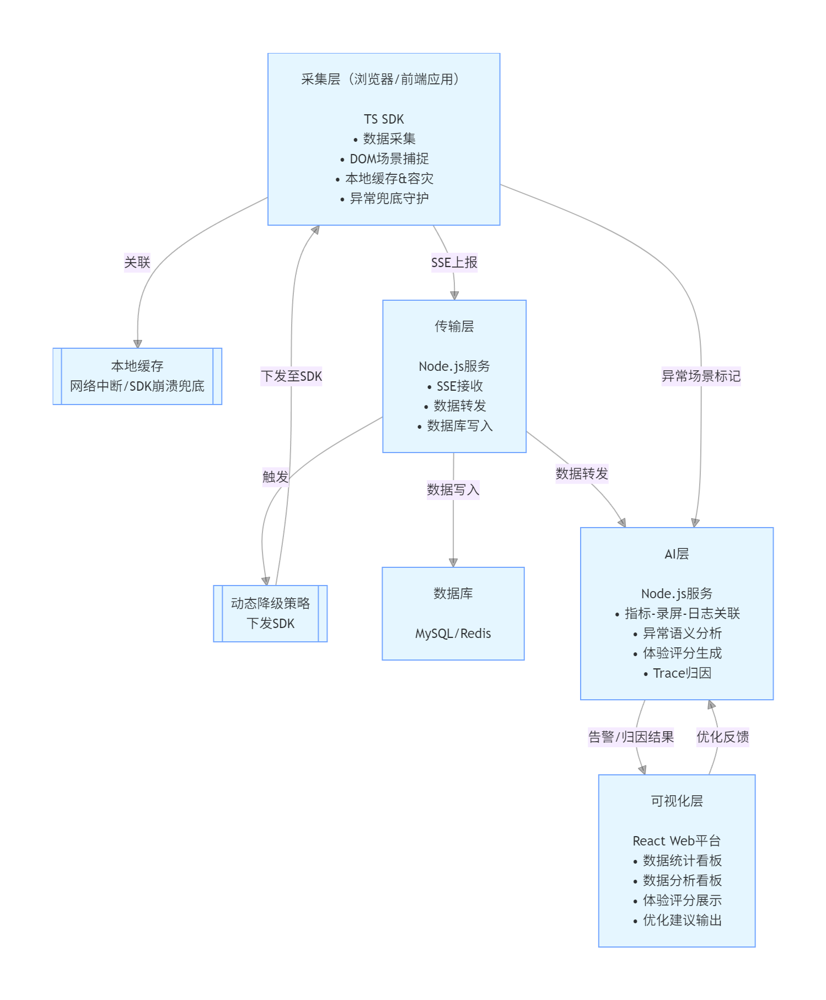
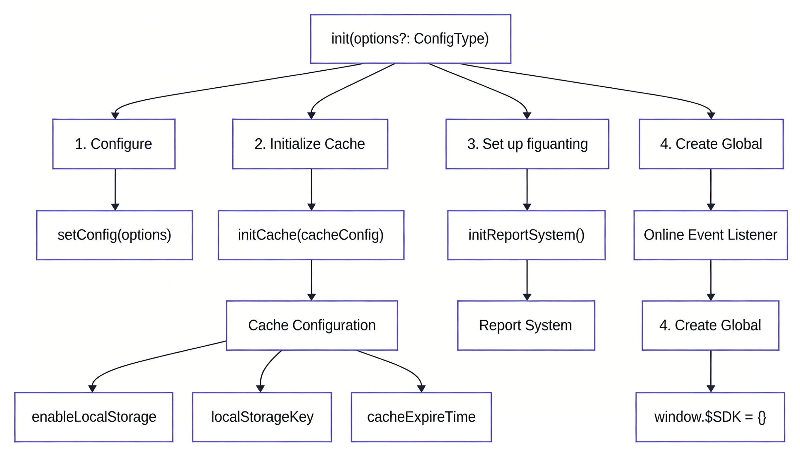

# 邓雄峰_开题报告 解析稿

## 来源映射
- 源文件（doc）: 邓雄峰_开题报告.doc
- 转换文件（docx）: 邓雄峰_开题报告.docx
- 解析时间: 2026-04-11 04:07:40
- 转换方式: Word COM 批量转换（doc -> docx）
- 输出文件: 邓雄峰_开题报告.md

## 文档概览
- 正文段落数: 2
- 识别标题数: 0
- 表格数: 2
- 图片数: 2
- 估算字符数（去空白）: 3554

## 章节结构（自动识别）
1. 未识别到标准标题样式，正文可能为连续段落。

## 关键信息提炼
### 主题词频
- 设计: 15 次
- 实现: 12 次
- 系统: 10 次
- 性能: 9 次
- 日志: 4 次
- 安全: 2 次
- 需求: 2 次
- 数据库: 1 次
- 部署: 1 次

### 缺失项提示（用于后续补写）
- 摘要
- 关键词
- 需求分析
- 系统实现
- 测试
- 结论

### 低置信度片段
- 未发现明显乱码或异常短段落。

## 图片提取与解读
- 已提取图片数: 2
- 图片目录: images/邓雄峰_开题报告
- 自动识别图题数: 0

### 图 1: 图片1
- 原始文件: image1.png
- 描述: 未提供图片描述，建议补充图题与图注。

### 图 2: 图片2
- 原始文件: image2.png
- 描述: 未提供图片描述，建议补充图题与图注。

## 详细内容（按解析顺序）
广东海洋大学 2026 届本科生毕业论文（设计）开题报告
学院： 数学与计算机学院 系： 计算机 专业： 计算机科学与技术

### 表格 1
| 学号 | 202211831105 | 姓名 | 邓雄峰 | 班级 | 计科1224 |
| --- | --- | --- | --- | --- | --- |
| 毕业论文 （设计）题目 | 智能的前端全链路监控系统设计与实现 |  |  |  |  |
| 指导教师 | 揭磊平 | 所在单位、部门 | 数学与计算机学院 | 职称 | 讲师 |
| 研究背景 随着 Web 应用深入用户核心链路，前端代码的稳定性与性能直接决定产品成败，Web 应用程序的用户体验是其成功的关键因素之一，如何优化 Web 应用程序的用户体验是一个重要的问题。针对传统 Web 应用前端数据监控平台存在的一系列操作缺陷，此次研究提出了一种基于用户体验的 Web 应用前端数据监控平台优化方法。整个数据监控平台的优化从优化整体设计和布局、优化前端开发工具、优化后端服务、优化用户界面设计展开。研究结果表明，通过上述优化操作，能够有效提高用户的 Web 应用体验感，并且能够帮助用户更好地观察到应用软件的变化，同时也能保证网页能够更好地识别异常数据，从而确保网络安全[1]。但浏览器侧异常、资源失败、长任务卡顿等问题往往无法被服务端日志捕获，导致故障发现滞后、根因排查困难。传统前端监控多停留在简单上报与阈值告警层面，面对高重复、弱网络、碎片设备带来的海量噪声，极易陷入“数据很多、信息很少”的窘境。本课题立足“智能”视角，设计并实现一套从前端现场直接完成数据降噪、异常归因与体验量化的端到端监控系统：在用户浏览器内以轻量模型实时识别有效异常、关联用户行为路径、生成可回放的诊断 Trace，并收敛为可解释的体验评分，使监控自身具备思考与决策能力，从而缩短排障路径、降低告警误报、辅助研发持续优化用户体验。 研究现状 如何对 Web 前端页面进行实时监控并进行有效分析，国内外的技术人员和企业都在不断研究探索。国外研究起步稍早，国内互联网的领先者如 BAT 也逐渐意识到其重要性，并投入大量人力致力于前端实时监控平台的研究。下面将对国内外关于 Web 前端监控的相关成果进行简单阐述[2]。 New Relic 国外端到端监控平台，支持前端页面性能（加载速度、渲染、JS错误等）与后端服务监控。提供 Production 和 Developer 两种模式，支持本地开发环境实时查看性能数据。有 Free 和 Enterprise 版本，适用于全面性能观测。 Sentry 开源错误追踪与性能监控系统，用 Python 编写，主要功能是收集代码崩溃日志并实时通知开发者。支持自建监控平台，广泛用于异常告警和问题定位，适合开发阶段快速发现并修复 Bug。 Webfunny 专注微信小程序、H5 和 PC 前端的实时监控，提供错误统计、性能分析、预警通知等功能。支持私有化和容器化部署，可二次开发，价格相对较低，适合预算有限且需自主可控的团队。 ARMS（应用实时监控服务，阿里云） 阿里巴巴推出的全栈性能监控产品，涵盖前端（浏览器、小程序等）与后端应用监控。前端监控聚焦页面加载各阶段耗时和运行时状态，数据上报后实时分析并可视化展示。提供 15 天免费试用，适合全链路诊断与端到端追踪。 研究目标与价值 本研究构建AI赋能的高可用前端全链路监控系统，实现“采集-分析-优化”闭环。核心目标为提升SDK稳定性与AI分析效能，通过强容灾设计保障监控连续性，实现异常提前预警与精准定位。系统将在开源项目验证，达成降低故障发生率、缩短排查周期的应用价值。 关键技术问题与解决策略 录屏数据轻量化处理：前端录屏易生成大体积数据，系统采用DOM快照增量存储结合异常触发的按需录制策略，仅留存关键操作帧与异常时段画面，可将单段录屏数据体积压缩60%以上，有效降低数据传输带宽与后端存储压力。 AI驱动的精准定位与高效处理：针对传统监控定位模糊、效率低的问题，通过AI建立指标-录屏-日志的关联，结合语义分析标记异常触发点，实现故障定位精度提升，处理效率提升。 SDK容灾与异常监控：构建保障——本地缓存、、异常兜底（插件崩溃时触发守护进程）；覆盖插件失败、跨域错误等场景，AI辅助异常标记分级，保障监控连续可追溯。 研究方案与实施进度 技术路线设计 初步设计： 采用四层架构：采集层（TypeScript SDK，含采集、录屏、容灾）→传输层（SSE+数据库，后端数据转发）→AI层（Node.js服务，关联分析与推理）→可视化层（React，分析与回放），实现“采集-分析-还原-优化”闭环。 项目整体架构 本系统遵循“轻量化采集—可靠传输—智能分析—高效呈现”的分层设计理念，技术选型兼顾性能、兼容性与工程可维护性。前端监控探针采用 TypeScript 进行模块化开发，构建输出兼容主流前端框架（React、Vue、Angular 及原生 JavaScript）的发布产物，确保无感集成；数据上报策略采用 Beacon API 与 Server-Sent Events（SSE）相结合的方式，在保障会话完整性的同时兼顾弱网环境下的传输可靠性，异常场景下自动降级至浏览器端 IndexedDB 实现本地暂存与重试。服务端基于 Node.js（TypeScript）构建轻量转发与预处理层，承载数据清洗、去重及上下文补全任务；基于复杂 AI 推理任务实现异常分类、根因定位与体验评分等模型训练与推理，前后端通过 RESTful API 与 gRPC 协议完成异步调用与结果回传。持久层采用 MySQL 存储结构化监控指标与事件日志，Redis 提供实时去重、频率控制与短时缓存，对象存储组件 MinIO 承载经 DOM 快照增量压缩后的录屏片段，支持冷热数据分离与低成本归档。可视化前端基于 React + TypeScript 框架，结合 主流组件库与 ECharts 图表引擎，集成 rrweb-player 实现可回溯的用户行为录屏渲染；工程构建采用 Vite 工具链以提升开发效率与页面加载性能，形成“端—边—云”协同的全链路技术支撑体系。 图 1 整体项目结构流程图 SDK作为前端数据监控与采集系统的核心基础设施，本 SDK 承担着应用程序环境构建、配置参数加载及服务启动的关键任务。系统采用 TypeScript 语言构建，利用其静态类型检查机制确保 ConfigType 配置参数的完整性与类型安全，整个初始化流程通过 init 接口作为统一入口，遵循高内聚、低耦合的设计原则。在具体执行逻辑上，SDK 首先调用 setConfig 完成环境参数的注入与解析，然后触发 initCache 模块构建本地缓存机制；该机制基于 HTML5 Web Storage 技术栈，通过配置 localStorageKey、过期时间及最大容量限制策略，有效实现了对断网环境下数据的持久化存储与流量控制。紧接着，initReportSystem 启动上报子系统，该环节深度融合了 DOM 事件流监听技术与离线容灾策略，不仅能够注册在线事件监听器以实时捕获用户交互行为，更具备在网络恢复时自动检测并上传离线数据的能力，从而大幅提升了数据采集的完整性与传输可靠性。最终，SDK 依据单例模式设计思想，将实例化对象挂载至全局 window 作用域，完成了从配置加载到服务就绪的全链路初始化，为后续的业务监控提供了稳定且高效的运行时环境。 图 2 sdk架构 研究方法与创新点 .1 研究方法 文献研究法：梳理前端监控、AI分析及SDK容灾的核心文献与标准。 2. 需求调研法：结合自身实习经验，充分考虑真实业务场景监控需求并量化。 .2 创新点 1. 指标体系创新：“基础+AI衍生”双层设计，将AI分析转化为可量化指标。 分析闭环创新：融合录屏+容灾+优化，实现“检测-还原-定位-优化”全流程支撑。 3. 容灾创新：多重SDK高可用机制，解决网络中断、插件崩溃等监控中断问题。 参考文献 白美玲.基于用户体验的Web应用前端数据监控平台的优化处理方式[C]//香港新世纪文化出版社.2023年第六届智慧教育与人工智能发展国际学术会议论文集（第三卷）.通辽职业学院;,2023:236-237.DOI:10.26914/c.cnkihy.2023.074586. 李玲.Web前端监控平台的设计与实现[D].中国地质大学(北京),2022.DOI:10.27493/d.cnki.gzdzy.2022.001750. |  |  |  |  |  |

### 表格 2
| 工作计划进程表 |  |
| --- | --- |
| 时 间 | 工 作 内 容 |
| ： ： ： ： ： ： |  |
| 选题是否合适： 是 □否 方案是否可行： 是 □否 进程是否合理： 是 □否 任务能否完成： 能 □不能 指导教师 （签字） 年 月 日 | 选题是否合适： 是 □否 方案是否可行： 是 □否 进程是否合理： 是 □否 任务能否完成： 能 □不能 指导小组组长 （签字） 年 月 日 |

## 用于 Prompt 的输入建议
- 先锁定本文件中的已知事实，再生成章节正文，避免跨文档误引。
- 对“缺失项提示”中的章节优先补齐证据链与边界条件。
- 涉及数据、接口、参数时，仅引用文档原文中可定位的描述。
- 若需要改写为学术语体，应先保留术语不变，再做句式规范化。